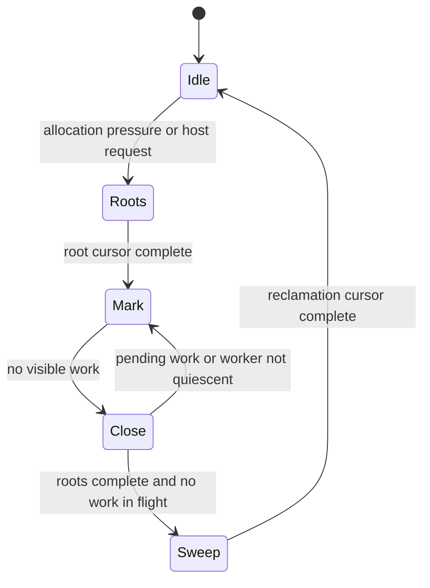

# Bounded garbage collection: two designs for Boomkat

**Status: cooperative core implemented and validated. Optional concurrency
and page batching remain proposals.**

Measurements and validation: [cooperative GC results](../benchmarks/gc-cooperative-results.md).

This plan compares a concurrency-ready collector with a simpler cooperative
collector. Both replace generational collection with resumable tracing and
reclamation. Both preserve nonmoving objects, support embedded builds, and use
the typed store boundaries introduced in `68faeb5c`.

The recommended destination is **Design A**, with optional concurrent marking.
The recommended first implementation is its cooperative tracing core. Enable
concurrent reads only after the synchronization and publication protocols pass
their gates. **Design B** is a complete alternative if those protocols cost more
than their measured benefit: all tracing stays on the VM thread, and optional
workers release detached storage only.

## 1. Requirements and evidence

### 1.1 What success means

- Every observed GC interruption is below **4 ms** on the agreed workloads and
  target devices, including construction and allocation assists.
- Normal scheduled slices use a **0.5 ms** soft deadline. Final measurements
  peak at 0.503 ms; the deadline is not a hard upper bound.
- Heavy VDOM, the 10k/100k/300k scenes, string churn and low-memory operation are
  acceptance workloads. A small benchmark alone cannot establish success.
- Throughput, peak memory and total GC CPU must accompany pause measurements.
- Embedded builds have no threading dependency or worker synchronization cost.
- Host callbacks, string destruction, cache maintenance and root traversal have
  explicit scheduling and lifetime rules.

An ordinary OS, general-purpose allocator and unrestricted native callbacks do
not provide a hard realtime guarantee. The implementation must distinguish a
measured pause objective from a proven worst-case bound. A deadline checked
between operations cannot bound the operation already running.

### 1.2 Current evidence

The implementation baseline is `8dd4427c`. Its recorded C3 0.8.3/macOS ARM64 profile gives:

| Workload | Maximum minor | Maximum major | Maximum deferred sweep |
| --- | ---: | ---: | ---: |
| Scene 10k | 0.649 ms | 0.813 ms | 0.340 ms |
| Scene 100k | 15.648 ms | 16.504 ms | 3.100 ms |
| Scene 300k | 27.012 ms | 33.516 ms | 5.283 ms |
| Heavy VDOM | 0.544 ms | 0.509 ms | 1.133 ms |

At 300k, root and graph tracing reaches 33.478 ms; young sweeping reaches
20.460 ms; remembered-owner tracing reaches 9.742 ms. Major string-table scanning
reaches 0.069 ms. These phase maxima need not occur in the same collection.
Release wall time regresses approximately 6–9% against the saved
`c3c18245` binary. See the [measurement report](../benchmarks/gc-string-ownership-profile.md)
for methodology and raw data. These are existing results, not measurements of
either proposal.

The immediate problem is work performed without yielding: making a collection
generational does not bound a large remembered container, live graph or cleanup
operation. Moving that same work to a worker also leaves root pauses, handshakes
and allocation stalls to solve.

### 1.3 Scope decisions

Keep `PropValue`, owner-aware stores and `@set_edge`, strengthening their
contracts. Remove young/old classification, promotion and remembered-set
collection from the proposed tracing algorithm. Preserve lazy sweeping while
making each reclamation operation resumable.

Keep the string ownership fixes. An identical native probe on fresh builds of
`c3c18245`, `68faeb5c` and `8dd4427c` runs 10,000 `replace` callbacks returning
2,048-byte strings, then counts retained large-string payload before collection.
The first two retain 203 strings / 413,723 bytes; `8dd4427c` retains one string /
27 bytes. This establishes that the retention problem predates generational GC.
It measures retained payload, rather than reproducing the separate recorded
20,880,068 → 34,238 peak-byte result. [Plan 094](094-string-ownership.md) defines
the ownership contracts.

Neither design introduces moving objects, concurrent JavaScript execution within
one heap, a JIT, or new WeakMap/FinalizationRegistry semantics. Independent heaps
may run on independent host threads. A heap has exactly one mutator.

## 2. Lessons from other collectors

| Engine or family | Relevant mechanism | Consequence for this design |
| --- | --- | --- |
| V8 | Incremental/concurrent marking with barriers and a protocol for mutable object layouts | A barrier alone does not make worker reads safe |
| Go Green Tea | Page-oriented work and separate discovered/scanned state | Improve tracing locality without retaining every object on a touched page |
| Luau | Incremental tracing, allocation pacing and page-oriented reclamation | Fit the game loop; examine residual atomic work and large objects |
| Unity | Incremental GC scheduled across frames | Spending spare frame time is useful, but mutation can defeat progress |
| Unreal | Barrier-aware references and a configurable reachability budget | Typed stores are a correctness boundary; a time limit remains soft |
| QuickJS | Reference counting with cycle collection | Prompt releases do not inherently bound release cascades or cycle collection |

Sources: [V8 concurrent marking](https://v8.dev/blog/concurrent-marking),
[Green Tea](https://go.dev/blog/greenteagc),
[Luau performance](https://luau.org/performance/),
[Unity incremental GC](https://docs.unity3d.com/Manual/performance-incremental-garbage-collection.html),
[Unreal incremental reachability](https://dev.epicgames.com/documentation/en-us/unreal-engine/incremental-garbage-collection-in-unreal-engine),
[QuickJS internals](https://bellard.org/quickjs/quickjs.html#Garbage-collection).

Sub-millisecond pauses require keeping whole-heap work outside the pause and
removing heap-size-dependent termination work. Go's account of reducing pauses
includes eliminating end-of-mark stack rescanning; ZGC moves substantial work
into concurrent phases using machinery substantially beyond a simple mark/sweep
collector. Neither result transfers automatically to Boomkat.
[Go latency history](https://go.dev/blog/ismmkeynote),
[ZGC guide](https://docs.oracle.com/en/java/javase/26/gctuning/z-garbage-collector1.html).

### Green Tea's precise role

Adopt the idea of queuing pages and scanning discovered objects in address
order. Maintain separate discovered and completed state, and requeue a page
when it acquires more work. Undiscovered objects remain collectible even if
their neighbors are live. A page is a scheduling/locality unit, never an
indivisible pause unit.

Start with scalar scanning and a fast path for sparse work. SIMD and
architecture-specific pointer decoding are separate experiments. Go's reported
GC CPU improvements are evidence for investigating locality, not a prediction
of Boomkat's speedup or a pause guarantee.
[Algorithm and motivation](https://go.dev/blog/greenteagc).

## 3. Shared correctness model

### 3.1 Traced nodes and owned resources

Use an explicit node kind for objects, environments, buffers and BigInts.
Only kinds with outgoing traced edges need scanning. Do not cast every traced
pointer to `HObject*`; the header and payload layout must match its kind.
Generators, suspended frames, promises, module records and native roots need
an explicit place in the reachability graph.

Strings retain their independently selected ownership policy. The marker does
not manipulate string reference counts. Resource ownership and graph liveness
are separate responsibilities:

| Item | Lifetime authority | Mutable access |
| --- | --- | --- |
| Traced node | Collector cycle and allocation publication | Mutator; guarded marker reads in A |
| String reference | Explicit retain/release owner | Mutator |
| Array/property backing store | Its container and retirement protocol | Mutator; guarded reads in A |
| Native root | Registered scope or persistent handle | Mutator |
| Worker packet | Worker/control protocol | Its current owner |
| Detached allocation | Reclamation queue | Reclaimer only |

No node can be explicitly freed while a marker packet can contain its address.
Audit any RC or error path that frees a traced node: unpublished allocations
may roll back locally; published nodes must follow collector retirement.

### 3.2 Insertion barrier

Use an incremental-update barrier. While marking is active, **every newly
stored traced value is shaded**, without first testing whether the owner is
black. The same rule applies to roots. This deliberately avoids subtle owner
color and partially scanned container conditions in the first implementation.

Here, shading means marking a node discovered and making its unfinished scan
discoverable by the scheduler. It must not allocate, invoke JS, trigger a
collection recursively, or fail after the store commits.

The store operation is conceptually:

1. Acquire any required string ownership for the replacement.
2. Enter the field synchronization domain in Design A.
3. Shade the replacement if marking is active and it is traced.
4. Publish the field value.
5. Leave the synchronization domain.
6. Release the replaced owned resource through its bounded release path.

Phase changes occur on the mutator at safepoints, never midway through this
operation. The concurrent worker cannot declare marking complete independently.
Self-assignment must retain before release. Clearing a traced edge needs no
deletion marking under this algorithm, but still obeys ownership and concurrent
field synchronization rules.

An SATB alternative would log overwritten values, including stores of numbers,
undefined and deleted sentinels. It would therefore invalidate the assumption
that `set_untraced` can bypass marking work. SATB is not selected here: it adds
deletion logging and buffer lifetime obligations without an established benefit
for this engine.

### 3.3 Roots are part of the barrier contract

Scan roots incrementally, with cursor state for globals, VM registers, active
frames, suspended generators, module state, native scopes and persistent host
handles. A root added after the cursor passes must shade its initial value.
Every subsequent traced root assignment must shade its replacement.

This includes register moves, argument setup, return values and stack growth.
A heap-only barrier is insufficient: a value can move from an unscanned root
into an already scanned root and otherwise disappear from the marker's view.
Measure the cost of root/register barriers explicitly.

The VM owns root enumeration. Workers never walk a live C3 stack. Native code
that retains a value across allocation or a callback must use a registered
root. Raw local pointers are borrowed only while an owner or registered root
keeps the target alive.

Root cursors use stable registry entries or frame identifiers plus indices.
Popping a frame cancels its pending range; adding a frame shades its inputs.
Stack relocation cannot leave a saved slot pointer behind. The closing phase
must not fall back to rescanning every register or generator.

### 3.4 Resumable scanners

A scan cursor contains a node identity, a field/range kind and an index. It
does not retain a pointer into a resizable backing store. Each scan step resolves
the current backing store and copies or visits a bounded range.

Split all potentially large operations:

- Array elements and property slots.
- Environment bindings and parent chains.
- Generator registers, stacks and saved frames.
- Promise reaction storage and module dependency tables.
- Shape-owned references and cache registries where applicable.
- Dead-object cleanup, string releases, pool traversal and table maintenance.

Moving a live value to an index behind a scan cursor is a store and needs the
barrier. Bulk `memcpy`, `memmove`, rehashing, compaction and buffer replacement
must use range-aware operations. No generic scanner may recursively traverse
an unbounded chain.

### 3.5 Allocation and publication

Distinguish private construction from published graph membership. Private
construction cannot cross a safepoint or reenter JS unless the partially
initialized object has first been published with valid slots and rooted.

Publishing during marking makes the allocation live for this cycle and queues
its initialized outgoing edges for scanning. Later stores use normal barriers.
Publishing during sweeping excludes the allocation from that cycle's dead set.
Initialization without barriers is allowed only inside this explicit protocol;
it cannot depend on promotion happening at a convenient time.

Use a cycle allocation boundary or epoch to distinguish new storage from sweep
candidates. This is allocation bookkeeping, not an age generation. Initialize
metadata before publication and reset it during bounded page processing. Epoch
wrap must not produce a surprise whole-heap clearing pause.

## 4. Design A: optional concurrent marking with page work

### 4.1 Structure

- One mutator per heap, initially at most one marker worker.
- Nonmoving nodes grouped into size-class pages with explicit descriptors.
- Per-page allocation/discovery/completion metadata, range cursors and pending
  work membership.
- VM-only root scanning, resource ownership updates and semantic destruction.
- Worker scans bounded snapshots of traced edges under synchronization.
- Cooperative mode executes the same scan tasks without worker synchronization.

The page allocator is a small purpose-built layer over the heap's configured
allocator. It owns the metadata the collector needs. Do not depend on private
`FixedBlockPool` layout or infer live allocations from its freelist.
Large nodes and backing stores have explicit descriptors and bounded ranges;
they need not occupy normal small-object pages.

### 4.2 Field synchronization

The initial concurrent protocol uses a mutex per page, with a corresponding
guard for separately allocated large containers. The worker uses `try_lock`:
if a page is busy, it defers that task. Under the guard it reads the current
layout and copies a small fixed batch of **traced node references** into its
private packet, then unlocks before shading children.

The mutator uses the same guard for every field or layout change observed by
the worker, including primitive overwrites, clearing slots and swapping backing
buffers. The guard is held for a fixed amount of pointer-copy/update work; no
allocation, callbacks, string release or logging occurs inside it. Allocate
replacement buffers before entering the guard. Process large updates in chunks
while keeping the container valid between chunks.

Worker packets contain stable node identities, not borrowed strings, raw slot
pointers or live backing-store pointers. The worker finishes using a backing
store before releasing the guard, so the mutator can retire that store after
its guarded replacement. Traced nodes themselves remain allocated until mark
completion and worker quiescence.

This protocol avoids racing ordinary C3 reads and writes, including 16-byte
NONANBOX values. Atomic mark bits alone would not do that. A seqlock with
ordinary racing payload reads would not do it either.

**Latency limitation:** a VM lock acquisition can wait for a descheduled worker.
Short critical sections reduce the usual cost but do not bound OS scheduling
delay. Record these waits as GC interference. If they threaten the pause target,
keep concurrent marking disabled and use cooperative execution. Do not silently
replace this protocol with unsynchronized reads. An atomic-slot protocol would
be a separate design requiring a portable NONANBOX and layout solution.

### 4.3 Work publication without allocation

Each page has intrusive queue membership and pending discovery metadata.
Discovering an object sets its discovered/pending state before ensuring its page
is scheduled. One page can appear at most once in the shared queue. A deque
growth in the barrier is forbidden.

Use a short scheduler mutex for queue transitions in the first version. Define
three page states: idle, queued and owned by scanner. A producer finding an
owned page records pending work; the scanner checks it under the scheduler
protocol before returning the page to idle. This prevents a discovery from
being lost between the scanner's final check and queue removal.

Keep field locks and scheduler locks separate. Shading may acquire the scheduler
lock while holding a field guard; therefore the worker must release the scheduler
lock before acquiring any field guard. Document and assert this lock order.
No worker holds two page guards at once.

An in-flight packet counts as work until all children have been shaded. A
node's completed state is set only after its last range is scanned. Finding a
partially scanned node again does not create a second cursor. Metadata pages
are allocated before their nodes become publishable; failure rolls back the
allocation, never drops a marking task.

### 4.4 Cycle state machine

Marking barriers are active throughout Roots, Mark and Close. The worker may
trace discovered nodes while the VM advances root enumeration.

Close is a handshake, not a full traversal. At a safepoint the mutator checks
root completion, shared pending work, scanner ownership and worker packets.
The worker acknowledges quiescence only after publishing all discoveries and
dropping all borrowed access. The mutator does not wait indefinitely for that
acknowledgment: it returns to execution with marking active and retries later.
Under the scheduler protocol, an empty acknowledged system permits committing
the dead set and disabling the insertion barrier. One worker makes this
termination argument substantially easier than a general work-stealing pool.

Sweep runs only after the marker has relinquished this cycle's objects. Finish
its bounded work before starting another marking cycle. Pacing must reserve
enough headroom for this serial cycle policy; do not force `finish_sweep` over
the entire heap to make room for the next cycle.

### 4.5 Host objects, weak structures and callbacks

Host tracing runs on the mutator unless the host explicitly supplies a safe
snapshot protocol. Prefer a registered array of traced host slots updated
through the heap barrier. A legacy arbitrary `gc_mark` callback cannot promise
bounded scanning; classify it as an unbounded extension until converted.
Permanently remembering an object does not solve incremental root races or
callback duration.

Preserve the engine's implemented weak/cache semantics. Weak cache entries must
be invalidated or checked against the committed dead set before they can return
a reclaimed node. Cache pruning itself is resumable. A cache hit that creates a
strong reference during marking uses the root barrier.

True ephemeron processing requires its own resumable fixed-point phase and
mutation protocol before Close can commit. Do not claim a future WeakMap is
handled by ordinary strong scanning. User finalization and resurrection also
require a separate state machine; storage release must never invoke JS on a
worker.

## 5. Design B: cooperative tracing, optional background release

### 5.1 Structure

All roots, fields, layouts and mark state belong to the mutator. Every scan and
sweep is a bounded task executed at a safepoint or a host-requested GC step.
The insertion barrier, publication rules and root coverage from section 3
remain necessary because JavaScript runs between slices.

Keep the existing object pools initially. Use an intrusive gray queue with one
membership per node and explicit range cursors. Store the necessary metadata
in a measured header extension or a dedicated descriptor; do not hide it in
unrelated subtype flags. A range is processed, then the node is requeued if it
has more work. This gives fairness without allocating a task per array segment.

No worker reads live objects. Consequently ordinary field loads/stores and
mark state need no cross-thread synchronization. Page batching remains an
optional locality experiment rather than a prerequisite allocator migration.

### 5.2 Optional worker

The VM performs all semantic destruction: removing registry entries, releasing
owned references and detaching buffers. It can then transfer an immutable batch
of raw allocations to a worker for allocator release, but only when the host
allocator explicitly supports cross-thread free.

The handoff transfers exclusive ownership. A detached block contains no pending
JS callback, reference-count update, pool freelist edit or observable engine
state change. Worker completion can report released bytes; it cannot mutate
the VM's pool structures. If these conditions do not hold, release on the VM
in bounded batches instead.

Queue saturation leaves blocks on the VM's pending-release list and contributes
to memory pressure. It does not make a barrier wait for a worker. Reclamation
queue ownership and shutdown use a simple mutex/condition-variable protocol.

### 5.3 Strengths and limits

This is the smaller implementation and proof surface. It supports embedded
targets naturally, avoids marker/VM lock contention, and keeps custom allocator
and native callback affinity straightforward. It can meet a small pause target
if every operation is genuinely split.

Its total tracing work consumes VM/frame time. Under allocation-heavy load,
bounded slices may not reclaim memory fast enough without frequent assists or
more heap headroom. A low maximum pause can coexist with poor throughput.
Background freeing does not accelerate the 33 ms graph traversal itself.

Moving from B to A requires adding and auditing synchronization at every
GC-visible mutation and replacing or augmenting pool metadata. It is not a
feature flag that becomes safe merely because the insertion barrier exists.

## 6. C3 implementation decisions

### 6.1 Verified toolchain and stdlib

The design was checked against installed **C3 0.8.3**, Homebrew `0.8.3_1`, with
stdlib source under `/opt/homebrew/Cellar/c3c/0.8.3_1/lib/c3/std`.
This path identifies the inspection environment, not a portable build input.
The [versioned upstream stdlib](https://github.com/c3lang/c3c/tree/v0.8.3/lib/std)
is the public reference; validate availability on each supported toolchain.

| Capability inspected | Use and constraint |
| --- | --- |
| `std::atomic::types::Atomic{T}` in `atomic.c3` | Shared metadata only; explicit ordering at publication boundaries |
| `std::thread::Thread`, `Mutex`, `ConditionVariable` in `threads/thread.c3` | One owned worker with explicit startup/shutdown |
| `threads/threadgroup.c3` | Explicitly experimental and warns against production use; not selected |
| `threads/threadpool.c3` | Gated by `NEW_THREADPOOL`; unnecessary lifecycle and queue policy for one marker |
| `std::collections::deque::Deque{T}` | Useful outside the barrier; `push` can reserve and allocate |
| `std::core::mem::mempool::FixedBlockPool` | Useful in B; does not expose the GC page metadata A needs |
| `std::time::clock` and `Clock`/`NanoDuration` | Typed deadline accounting; verify native clock backend per target |

Use one dedicated `Thread`, not a generic task system. The GC already has a
small state machine and a work queue; layering a second scheduler over it adds
shutdown and allocation behavior to audit.

### 6.2 Types and APIs

Keep plain distinct types for `PropValue` and owned string references. Avoid
`inline` typedefs where implicit pointer conversion would erase an ownership
boundary. A plain distinct type prevents accidental ordinary assignment across
types; it does not prevent explicit casts or copying an owner.

Replace writable slot views in normal callers with value reads and owner-aware
mutation methods. The current `PropValue.view()` returns `TVal*`; a comment that
it is read-only is not an enforced access restriction. Tracers should consume
values or bounded visitor results. Internal raw slot access belongs in a small
audited storage module.

Use separate operations for initialization, owned copy, transfer, clear and
range replacement. Make transfer clear the source as part of the operation.
Do not rely on ordinary C3 assignment or `memcpy` to perform retain/release.
Use registered roots for scope lifetime and explicit `defer` cleanup.

Keep `@set_edge` narrow: dispatch with `$switch $Typeof(value)` and evaluate
the owner, destination and value once. Prefer ordinary methods where a macro
adds no type safety. Avoid a universal field-reflection framework; a small
explicit visitor per node kind makes ownership and scan cost reviewable.

### 6.3 Errors, cleanup and temporary memory

Use optionals and `faultdef` for recoverable initialization/allocation failures,
with `defer catch` for partial construction rollback. A failed worker startup
can select cooperative mode before worker state is published. Do not use `!!`
to turn ordinary memory pressure into an unexplained panic.
[C3 optional/error handling](https://c3-lang.org/language-common/optionals-essential/).

Use `defer` to release a successfully acquired guard. Handle mutex and condition
variable operation results explicitly where failure would invalidate ownership;
do not discard faults merely because an API allows it.

Zero initialization initializes storage, not every semantic value: JS undefined
must be initialized explicitly where required, and mutexes require `init`.
Never put cross-slice work in `@pool`/temporary allocator storage. A slice is a
borrowed pointer and length, not proof that the backing allocation remains live.

### 6.4 Atomics and compilation modes

Design A separates shared GC metadata from VM-owned bitstruct flags. Concurrent
read/modify/write of neighboring bits in one ordinary word is still a race.
Begin with mutex-protected scheduler transitions; use atomic bitmap operations
only where the synchronization proof names their ordering and ownership.

Do not require a lock-free 16-byte `TVal`. Both NaN-boxed and NONANBOX layouts
must use the same valid field access protocol. No pointer tagging assumptions
beyond the engine's existing supported representation are added.

Put worker declarations and imports behind `@feat(GC_CONCURRENT)` and use
`$if $feat(...)` for conditional bodies. The embedded build omits worker state,
locks and thread dependencies. Runtime disabling in a desktop binary is useful
for comparisons, but it is distinct from compiling threading out entirely.
Keep collector policy concrete instead of parameterizing the entire heap over
a family of generic GC strategies.

### 6.5 What “safe by design” can honestly mean

C3 supplies distinct types, contracts, modules, optionals and deterministic
scope cleanup. It does not supply a borrow checker or linear ownership system.
The design eliminates broad classes of error by making sanctioned operations
preserve invariants; raw pointers and unchecked casts remain escape hatches.

Keep those escape hatches few, local and auditable. Verify stores, publication,
root registration and retirement mechanically where possible. A claimed
impossibility of memory errors across arbitrary C3/native extensions would be
false.

## 7. Scheduling, reclamation and memory pressure

### 7.1 Two budgets

Each GC step takes both a time budget and a work limit. Charge examined slots,
root entries, bytes and destruction units, not just objects visited. Check a
monotonic deadline between small batches, and return the cursor when either
budget expires. Use `Clock`/`NanoDuration`, with an injectable host clock or
deterministic work-only mode on targets lacking a suitable native clock.

Begin with conservative fixed batches; tune using measured maximum batch cost.
Report overshoot separately. A large array, destructor or native callback must
not bypass budgeting because it counts as one object.

### 7.2 Bounded destruction

A dead object's cleanup cursor releases a bounded number of properties,
string references and auxiliary allocations per step. Keep the dead descriptor
until cleanup completes. Incremental cleanup must not read another dead node
whose payload has already been released; ownership cleanup may access only
still-owned resources or stable collector metadata.

Apply the same rule to RC zero-count processing: enqueue cascades rather than
recursively draining them. Intern-table deletion, resizing, pool release and
large allocator frees need accounting. Logical reclamation may precede physical
release, but pending bytes still count against the memory limit.

### 7.3 Pacing

Start a cycle before exhausting free space. Estimate allocation rate, tracing
throughput and reclamation backlog; reserve headroom for allocations during the
remaining cycle plus cleanup and worker queues. These estimates are policies,
not proofs that an allocation will succeed.

The host-facing proposal has three operations:

- Request collection, returning immediately.
- Perform a budgeted step and return phase, work done, elapsed time and pressure.
- Explicitly collect to completion for teardown/tools or a host-authorized
  blocking operation.

At high pressure, increase scheduling frequency first. If bounded work cannot
meet allocation demand, the host policy must choose additional memory,
allocation failure, or an explicitly permitted blocking collection. There is
no hidden “finish everything now” fallback compatible with the pause objective.

### 7.4 Shutdown

Stop admitting work, wake the worker, let it relinquish its packet, join it,
then free queues, descriptors and heap storage. Never detach a GC worker.
The embedded path runs the same ownership cleanup synchronously. Shutdown may
be blocking; report its timing separately from interactive pauses while still
including it in end-to-end benchmark wall time.

## 8. Decision matrix and implementation sequence

| Criterion | A: concurrent page tracing | B: cooperative tracing |
| --- | --- | --- |
| Pause control | Bounded VM work plus synchronization interference | Bounded VM work without marker contention |
| Total tracing CPU | Can overlap mutator; locality may improve work | Paid on mutator thread |
| Mutator overhead | Root/heap barriers plus guarded shared fields | Root/heap barriers |
| Memory | Page metadata, packets, headroom | Queue/cursor metadata and headroom |
| Embedded fit | Same core, threading compiled out | Direct fit |
| Allocator changes | Explicit page layer | Existing pools initially |
| Proof burden | Reachability plus publication, races and termination | Reachability and resumability |
| Native integration | Strict worker-read and callback boundaries | Simpler VM-thread affinity |

Choose A as the architectural direction, but ship its cooperative core first.
Select B as the final architecture if worker interference, metadata or store
overhead outweighs the benefit on the actual target machines. Page batching
can be evaluated independently of concurrent reads.

### Stage 0: preserve evidence and isolate changes

Record commit IDs, binaries, flags and raw benchmark outputs. Investigate the
string-churn baseline before deciding which ownership changes stand alone.
Remove generational machinery with targeted changes, preserving the typed
barrier boundaries and independently validated ownership behavior. Do not use
a blanket revert of the mixed ownership/generation commit.

### Stage 1: enforce boundaries

Audit every traced field, root and bulk write. Close writable slot-view holes;
classify native roots, host callbacks and private initialization regions.
Add debug checks for illegal stores and publication. Define node kinds without
unsafe object casts. The engine must remain correct with collection at every
legal safepoint before introducing incremental execution.

### Stage 2: cooperative incremental collection

Implement the insertion barrier, root cursors, range scans, close invariant and
bounded destruction. Replace unconditional pending-sweep completion in normal
allocation paths. This stage must meet the pause objective before concurrency
is credited with success.

### Stage 3: evaluate page locality

Measure node-queue tracing against page batching on identical workloads and
layouts where possible. Measure sparse graphs and large arrays as well as dense
scenes. Adopt the page layer only with a concrete metadata/throughput benefit
or a justified concurrency requirement.

### Stage 4: optional concurrent marking

Implement guarded reads and writes, work ownership, publication and termination.
Enable one worker first. Instrument lock waits, worker utilization, duplicate
scans and bytes retained for safety. Keep concurrent mode experimental until
race/lifetime tests and low-core-count benchmarks pass.

### Stage 5: select defaults and update architecture

Choose the desktop default from measured results; compile out workers for
embedded. Update `docs/architecture.md` to describe the implementation that
ships, and reconcile plans 093/094 with that result. Do not document proposed
concurrency as an existing engine capability.

## 9. Verification and performance gates

### Correctness

- A stopped-world full tracer is the debug oracle. Before sweeping, every
  oracle-reachable node must be live in the incremental result. Conservative
  extra retention for a cycle is allowed; missed live nodes are not.
- Exercise stores immediately before/after a cursor passes, root transfers,
  partially initialized publication, frame pop/growth, generator suspension,
  promise reactions and host reentry.
- Exercise array shrink/growth, property rehash, overlapping moves and deletion
  during marking. Force one-slot scan slices to expose boundary errors.
- Inject allocator and worker-init failures before publication. Exercise queue
  transitions and worker shutdown at every phase.
- Rebuild ASAN before running lifetime tests. Use ThreadSanitizer where the C3
  toolchain/platform supports it; otherwise record that gap and supplement with
  controlled interleaving tests. ASAN cannot prove absence of data races.
- Run Rosetta, local/module, embedding, golden and NONANBOX suites, followed by
  targeted test262 groups for changed surfaces. Run the full supported test262
  corpus at the release gate, comparing against the exact baseline selection.

### Performance

Use interleaved baseline/candidate release runs, warmups, fixed workload seeds,
recorded compiler flags and no concurrent builds. Keep profile instrumentation
out of release throughput comparisons. Run all scene sizes and **heavy VDOM**;
also include a huge single array, deep graph, string churn, promise/generator
load and an allocation storm close to the configured memory limit.

Record p50/p95/p99/p99.9 and maximum interruption, maximum batch duration,
whole-frame latency, total wall time, GC CPU, peak live/committed memory,
reclamation backlog, allocation assists, root-barrier cost and lock wait time.
GC-induced VM lock waits and assists count as interruptions even when outside
the named GC-step function. Keep root, mark, close, destruction and allocator
release timers separate. Use per-worker counters merged at safepoints rather
than racing on the current global profile counters.

Acceptance requires no observed GC interruption at or above 4 ms over the
agreed sustained runs, with explicit hardware and memory limits. Report any
throughput or memory regression rather than trading it away silently. Also
report total frame spikes: successful GC slicing cannot eliminate unrelated
JavaScript, rendering, native callback or OS delays.

## 10. Open decisions that require evidence

1. **Resolved:** the ownership churn defect exists before `68faeb5c`; see §1.3.
2. What fraction of tracing cost is pointer chasing versus tag decoding and
   root enumeration? This determines the value of page batching.
3. What is the root/register barrier overhead in the interpreter?
4. Do short page guards still cause unacceptable waits on two-core machines?
5. How much heap headroom is required to keep assists within budget?
6. Which embedding callbacks and allocators support the proposed bounded or
   cross-thread contracts?
7. Which target devices can sustain the requested workload within both their
   frame budget and memory limit?

These decisions are experimental gates, not reasons to weaken the lifetime or
race invariants. The smallest implementation that meets the measured objectives
should become the default.

## 11. Cooperative core implementation

The implemented first stage uses one nonmoving allocation list and an explicit
`IDLE → MARK → SWEEP → IDLE` state machine. It retains the typed slot and edge
stores from `68faeb5c` and the independently verified string ownership fixes.
Young lists, promotion, remembered sets and minor/major scheduling are removed.

### Tracing and lifetime boundaries

- Objects and environments carry intrusive mark-queue links. Queue insertion
  requires no allocation. A generator queue entry acquires a state reference;
  its completion releases that reference through deferred retirement.
- Root traversal, object slots, captures, compiled constants, generator saved
  registers, weak-cache pruning and reclamation keep resumable cursors.
  Mutable arrays are reloaded from their owner on each step.
- Heap, register, root and environment stores shade newly published traced
  values during marking. `PropValue` exposes value reads and typed ownership
  helpers; it exposes no writable `TVal*` view.
- Threaded opcode handlers preflight publication before changing ownership.
  Values that need marking return to the normal interpreter path. Values that
  are already safe remain in handlers without out-of-line marker calls.
  `ENVREF` remains a traced value in both NaN-boxed and NONANBOX builds.
- Newly published compiled functions use a bounded constant/cache scan.
  Scoped `ObjectRoot`, `EnvRoot` and owned `ValueRoot` records protect native
  values across reentry. Removing a root or chain node adjusts active cursors.
- Collection begins and commits its dead set at a quiescent VM boundary.
  Native frames permit marking progress but defer sweeping. New allocations
  during sweeping prepend ahead of the sweep cursor.
- Object slot releases, environment cells, string-table entries and retired
  generator resources are processed in bounded batches. Reset and destruction
  explicitly drain or release a partially reclaimed object.

### Scheduling and measurement

Function safepoints allow 128 work units. Loop safepoints, reached once per
1,024 backward branches, allow 65,536 units. Both check a 0.5 ms deadline between
32-unit batches. This distinction prevents a call-heavy frame from consuming a
large collection at once while maintaining progress in allocation-only loops.
The budgets are scheduling policy; correctness does not depend on their values.

The profile records full scheduled slices, explicit blocking collection, native
shadow-root publication, string-table maintenance and lookup. Slice percentile
histograms have 10 μs resolution and preserve the exact maximum separately.
Whole-frame timing is recorded for both scenes and heavy VDOM. Release binaries
provide the throughput and process RSS comparison; profiler wall time includes
instrumentation overhead.

### Verification and remaining scope

`GC_VERIFY` compares incremental reachability with an independent full trace
before reclamation, then restores the candidate marks and environment epochs.
ASAN plus `POOL_BYPASS` exposes object frees to the sanitizer. Direct tests force
one-unit transitions, stores behind scan cursors, generator retirement,
reentrant callbacks, partial teardown and reset. A repeated allocation-only
loop checks that collection keeps retained nodes bounded.

Worker threads, atomic fields, page batching, moving collection and a public
host frame-budget API remain future work. Environment pool blocks and intern
capacity are retained for reuse during incremental collection. Intern-table
rehashing, allocator calls and host callbacks remain indivisible operations.
Shadow-root publication during marking scales with the saved frame size.
Finalizers must obey the host contract against allocation and resurrection.
C3 distinct types and narrow APIs make ownership reviewable; they do not impose
linear ownership or prevent every raw-pointer misuse.
